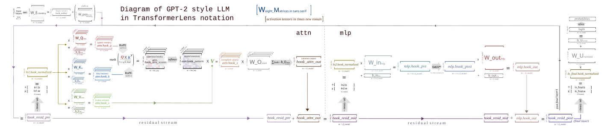

# TransformerBridge Model Structure

This page describes the structure exposed by TransformerBridge, the canonical hook names to use, and the expected tensor shapes at each hook point.

## Overview

TransformerBridge wraps a Hugging Face model behind a consistent TransformerLens interface. It relies on:
- An ArchitectureAdapter that understands the HF module graph and provides a mapping to bridge components
- Generalized components (Embedding, Attention, MLP, Normalization, Block) exposing uniform hook points
- A light aliasing layer for backwards compatibility with legacy TransformerLens hook names

Construct a bridge from a HF model id:

```python
from transformer_lens.model_bridge import TransformerBridge

bridge = TransformerBridge.boot_transformers("gpt2", device="cpu")
```

You can then call the familiar APIs: `to_tokens`, `to_string`, `generate`, `generate_stream`, `run_with_hooks`, `run_with_cache`.

## Architecture diagram

The diagram below maps weight matrices and activation tensors to their TransformerLens names. Hook points sit on the activation arrows — the canonical hook names in the rest of this document correspond directly to the labeled tensors here.



*Diagram by [Austin Kozlowski](https://github.com/akozlo). Click for full resolution.*

## Top-Level Components

Typical decoder-only models expose these top-level components (names vary by architecture):
- `embed`: token embedding
- `pos_embed` (if applicable) or rotary embeddings inside attention
- `blocks`: list-like container of transformer blocks
- `ln_final` (if applicable): final normalization
- `unembed`: output projection to vocabulary logits

Each `blocks.{i}` is a `BlockBridge` with subcomponents:
- `ln1`: normalization before attention
- `attn`: attention module
- `ln2`: normalization before MLP
- `mlp`: MLP module

## Canonical Hook Names

Use these canonical names when adding hooks or reading from the cache. Every name below exists on every `TransformerBridge` from boot, and the legacy `HookedTransformer` names in the [alias table](#legacy-alias-table) resolve to the same `HookPoint` objects whether or not compatibility mode is enabled.

Hook names fall into three groups, and it matters which group a name belongs to:

1. **Canonical hooks**: the `hook_in` / `hook_out` pair on every component, plus the named intermediates listed here.
2. **Aliases**: a legacy name bound to the *same* `HookPoint` as a canonical name. Same tensor, same shape, one firing.
3. **Flag-gated legacy hooks**: `HookPoint`s that carry a legacy name but are *not* aliases of any canonical hook. They capture a different tensor and fire only when the matching config flag is set: `blocks.{i}.hook_mlp_in`, `blocks.{i}.hook_attn_in`, `blocks.{i}.hook_q_input` / `hook_k_input` / `hook_v_input`, and `blocks.{i}.attn.hook_result`.

### Embedding
- `embed.hook_in`: token ids (batch, pos)
- `embed.hook_out`: token embeddings (batch, pos, d_model). Alias: `hook_embed`.
- `pos_embed.hook_in` / `pos_embed.hook_out`: learned positional embeddings, (batch, pos) / (batch, pos, d_model). Alias: `hook_pos_embed`. Rotary models have no `pos_embed` component; see `hook_rot_q` / `hook_rot_k` under attention.

### Residual stream
- `blocks.{i}.hook_in`: residual stream into the block (batch, pos, d_model). Alias: `blocks.{i}.hook_resid_pre`.
- `blocks.{i}.ln2.hook_in`: residual stream after the attention output is added back (batch, pos, d_model). Alias: `blocks.{i}.hook_resid_mid`. This is the sum, not the attention branch output (`blocks.{i}.attn.hook_out`).
- `blocks.{i}.hook_out`: residual stream out of the block (batch, pos, d_model). Alias: `blocks.{i}.hook_resid_post`.

### Attention
- `blocks.{i}.attn.hook_in`: the sublayer's argument, i.e. `blocks.{i}.ln1.hook_out` (batch, pos, d_model). Not an alias of `blocks.{i}.hook_attn_in`, which is flag-gated and per-head (below).
- `blocks.{i}.attn.q.hook_in` / `blocks.{i}.attn.k.hook_in` / `blocks.{i}.attn.v.hook_in`: input to each projection (batch, pos, d_model)
- `blocks.{i}.attn.q.hook_out` / `blocks.{i}.attn.k.hook_out` / `blocks.{i}.attn.v.hook_out`: projected heads (batch, pos, n_heads, d_head); K and V use n_key_value_heads under grouped-query attention. Aliases: `blocks.{i}.attn.hook_q`, `blocks.{i}.attn.hook_k`, `blocks.{i}.attn.hook_v`.
- `blocks.{i}.attn.hook_rot_q` / `blocks.{i}.attn.hook_rot_k`: rotary models only; Q and K after the rotation, same shapes as `hook_q` / `hook_k`.
- `blocks.{i}.attn.hook_attn_scores`: pre-softmax scores (batch, n_heads, pos, pos)
- `blocks.{i}.attn.hook_pattern`: post-softmax pattern (batch, n_heads, pos, pos). There is no hook named hook_attention_weights.
- `blocks.{i}.attn.o.hook_in`: per-head values weighted by the pattern (batch, pos, n_heads, d_head). Alias: `blocks.{i}.attn.hook_z`.
- `blocks.{i}.attn.o.hook_out`: output projection (batch, pos, d_model)
- `blocks.{i}.attn.hook_out`: attention branch output (batch, pos, d_model). Alias: `blocks.{i}.hook_attn_out`. On architectures with a post-attention norm (Gemma 2 / 3), `hook_attn_out` aliases `blocks.{i}.ln1_post.hook_out` instead, matching where `HookedTransformer` placed it.
- `blocks.{i}.attn.hook_hidden_states`: fused-QKV bridges only (GPT-2 family); fires on the tensor that `attn.hook_out` receives, immediately before it. Rotary attention bridges do not fire it. It is not an alias of `hook_result`.

Flag-gated attention hooks. Each exists on every bridge but fires only when its flag is set; all are (batch, pos, n_heads, d_model), with n_key_value_heads for the K/V inputs:
- `blocks.{i}.attn.hook_attn_in` (alias `blocks.{i}.hook_attn_in`): the pre-`ln1` residual replicated per head, with the norm applied per head afterwards. Gated by `cfg.use_attn_in` (`bridge.set_use_attn_in(True)`).
- `blocks.{i}.attn.hook_q_input` / `hook_k_input` / `hook_v_input` (aliases `blocks.{i}.hook_q_input` etc.): the same per-head pre-`ln1` fork, one copy per projection. Gated by `cfg.use_split_qkv_input` (`bridge.set_use_split_qkv_input(True)`). Not aliases of `q.hook_in` etc.
- `blocks.{i}.attn.hook_result`: per-head attention output before the sum over heads. Gated by `cfg.use_attn_result` (`bridge.set_use_attn_result(True)`).

### MLP
- `blocks.{i}.mlp.hook_in`: the sublayer's argument, i.e. `blocks.{i}.ln2.hook_out` (batch, pos, d_model). This is not the legacy `hook_mlp_in`; see below.
- `blocks.{i}.mlp.hook_pre`: pre-activation (batch, pos, d_mlp). Alias of `blocks.{i}.mlp.in.hook_out`. On gated MLPs (SwiGLU / GeGLU) it aliases `blocks.{i}.mlp.gate.hook_out`, and `blocks.{i}.mlp.hook_pre_linear` aliases `blocks.{i}.mlp.in.hook_out`, the ungated branch.
- `blocks.{i}.mlp.hook_post`: post-activation, the input to the output projection (batch, pos, d_mlp). Alias of `blocks.{i}.mlp.out.hook_in`.
- `blocks.{i}.mlp.hook_out`: MLP branch output (batch, pos, d_model). Alias: `blocks.{i}.hook_mlp_out`. On architectures with a post-MLP norm, `hook_mlp_out` aliases `blocks.{i}.ln2_post.hook_out` instead.
- `blocks.{i}.hook_mlp_in` (flag-gated, on the block): the MLP-branch entry point, which is `ln2`'s input on pre-norm blocks (the same tensor as `hook_resid_mid`) and the MLP's own input on post-norm blocks. Gated by `cfg.use_hook_mlp_in` (`bridge.set_use_hook_mlp_in(True)`), matching legacy `HookedTransformer`. It sits one norm earlier than `mlp.hook_in` and is not an alias of it or of `mlp.hook_pre`.

### Normalization
- `blocks.{i}.ln1.hook_in`: the norm's input (batch, pos, d_model)
- `blocks.{i}.ln1.hook_scale`: the per-token denominator, (batch, pos, 1): `sqrt(var + eps)` of the centered input for LayerNorm, of the raw input for RMSNorm
- `blocks.{i}.ln1.hook_normalized`: `x / scale` **before** the learned gain and bias (batch, pos, d_model)
- `blocks.{i}.ln1.hook_out`: the module's output, gain and bias applied (batch, pos, d_model)

These are four distinct tensors; none is an alias of another. `hook_scale` and `hook_normalized` keep their legacy `HookedTransformer` meaning (`ActivationCache.apply_ln_to_stack` divides by the cached `hook_scale`). Legacy `HookedTransformer` had no post-gain hook, so `hook_out` has no legacy equivalent. The same four hooks exist on `ln2`, `ln_final`, and on post-sublayer norms (`ln1_post` / `ln2_post`) where an architecture has them.

### Unembedding / Logits
- `unembed.hook_in`: (batch, pos, d_model)
- `unembed.hook_out`: logits (batch, pos, d_vocab). Alias: `hook_unembed`.

### Legacy alias table

Each row is checked against a tiny GPT-2 bridge and a tiny Gemma 3 bridge by `tests/unit/model_bridge/test_model_structure_doc.py`. To resolve an alias on a live bridge, read `bridge.hook_dict[name].name`.

| Legacy name | Resolves to | Note |
| --- | --- | --- |
| `hook_embed` | `embed.hook_out` | |
| `hook_pos_embed` | `pos_embed.hook_out` | `rotary_emb.hook_out` on rotary models, where it never fires |
| `hook_unembed` | `unembed.hook_out` | |
| `blocks.{i}.hook_resid_pre` | `blocks.{i}.hook_in` | |
| `blocks.{i}.hook_resid_mid` | `blocks.{i}.ln2.hook_in` | the residual sum, not `blocks.{i}.attn.hook_out` |
| `blocks.{i}.hook_resid_post` | `blocks.{i}.hook_out` | |
| `blocks.{i}.hook_attn_out` | `blocks.{i}.attn.hook_out` | `blocks.{i}.ln1_post.hook_out` when a post-attention norm exists |
| `blocks.{i}.hook_mlp_out` | `blocks.{i}.mlp.hook_out` | `blocks.{i}.ln2_post.hook_out` when a post-MLP norm exists |
| `blocks.{i}.attn.hook_q` | `blocks.{i}.attn.q.hook_out` | |
| `blocks.{i}.attn.hook_k` | `blocks.{i}.attn.k.hook_out` | |
| `blocks.{i}.attn.hook_v` | `blocks.{i}.attn.v.hook_out` | |
| `blocks.{i}.attn.hook_z` | `blocks.{i}.attn.o.hook_in` | |
| `blocks.{i}.mlp.hook_pre` | `blocks.{i}.mlp.in.hook_out` | `blocks.{i}.mlp.gate.hook_out` on gated MLPs |
| `blocks.{i}.mlp.hook_post` | `blocks.{i}.mlp.out.hook_in` | |
| `blocks.{i}.hook_attn_in` | `blocks.{i}.attn.hook_attn_in` | flag-gated, per-head; not `blocks.{i}.attn.hook_in` |
| `blocks.{i}.hook_q_input` | `blocks.{i}.attn.hook_q_input` | flag-gated, per-head; not `blocks.{i}.attn.q.hook_in` |
| `blocks.{i}.hook_k_input` | `blocks.{i}.attn.hook_k_input` | flag-gated, per-head; not `blocks.{i}.attn.k.hook_in` |
| `blocks.{i}.hook_v_input` | `blocks.{i}.attn.hook_v_input` | flag-gated, per-head; not `blocks.{i}.attn.v.hook_in` |

Not aliases of anything: `blocks.{i}.hook_mlp_in` and `blocks.{i}.attn.hook_result` are their own flag-gated `HookPoint`s; `hook_normalized` and `hook_scale` on every norm are distinct tensors from that norm's `hook_out`; `blocks.{i}.attn.hook_hidden_states` is its own hook.

## Shapes at a Glance

- Residual stream and hidden states: (batch, pos, d_model)
- Attention scores and patterns: (batch, n_heads, pos, pos)
- Q/K/V projections and `hook_z`: (batch, pos, n_heads, d_head)
- Flag-gated per-head inputs and `hook_result`: (batch, pos, n_heads, d_model)
- MLP pre- and post-activation: (batch, pos, d_mlp)
- Embeddings: (batch, pos, d_model)
- Unembedding logits: (batch, pos, d_vocab)
- Norm `hook_normalized`: (batch, pos, d_model); norm `hook_scale`: (batch, pos, 1)

These shapes are exercised in the multi-model shape test: `tests/integration/test_hook_shape_compatibility.py`.

## Booting from Hugging Face

`TransformerBridge.boot_transformers(model_id, ...)`:
- Loads the HF config/model/tokenizer
- Selects the appropriate ArchitectureAdapter
- Maps HF config fields to TransformerLens config (e.g., `d_model`, `n_heads`, `n_layers`, `d_mlp`, `d_vocab`, `n_ctx`, ...)
- Constructs the bridge and registers all hook points

## Fused QKV Attention

Some architectures use a fused QKV projection (GPT-2, GPT-Neo, Bloom, MPT). The bridge's `JointQKVAttentionBridge` splits the joint weight at setup into the same `q` / `k` / `v` sub-bridges that split-projection models expose, so `blocks.{i}.attn.q.hook_out`, the `hook_q` / `hook_k` / `hook_v` / `hook_z` aliases, `hook_attn_scores` and `hook_pattern` all work identically. Fused-QKV bridges additionally fire `blocks.{i}.attn.hook_hidden_states` on the attention output. The joint projection's own `blocks.{i}.attn.qkv.hook_in` / `blocks.{i}.attn.qkv.hook_out` exist but sit off the live path and never fire.

## Aliases and Backwards Compatibility

Legacy names are registered at boot on every bridge and resolve to the same `HookPoint` as their canonical target, so `cache["blocks.0.hook_resid_pre"]` and `cache["blocks.0.hook_in"]` are one tensor. `enable_compatibility_mode()` changes the *numerics* (folded and centered weights, matching `HookedTransformer`), not the set of names; the flag-gated hooks need their flag in either mode. New code should prefer the canonical names documented here. See [compatibility mode](compatibility_mode.md) for the weight-processing contract.

## Example: Caching and Inspecting Hooks

```python
prompt = "Hello world"
logits, cache = bridge.run_with_cache(prompt)

# List some attention-related hooks on the first block
for k in cache.keys():
    if k.startswith("blocks.0.attn"):
        print(k, cache[k].shape)
```

For larger examples and a multi-model shape check, see `tests/integration/test_hook_shape_compatibility.py`.
